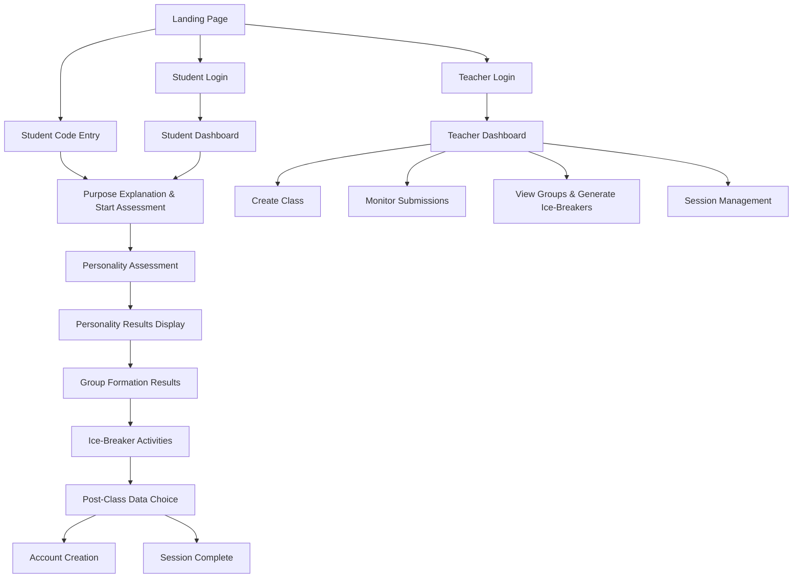
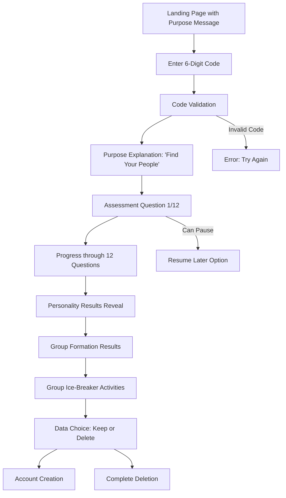
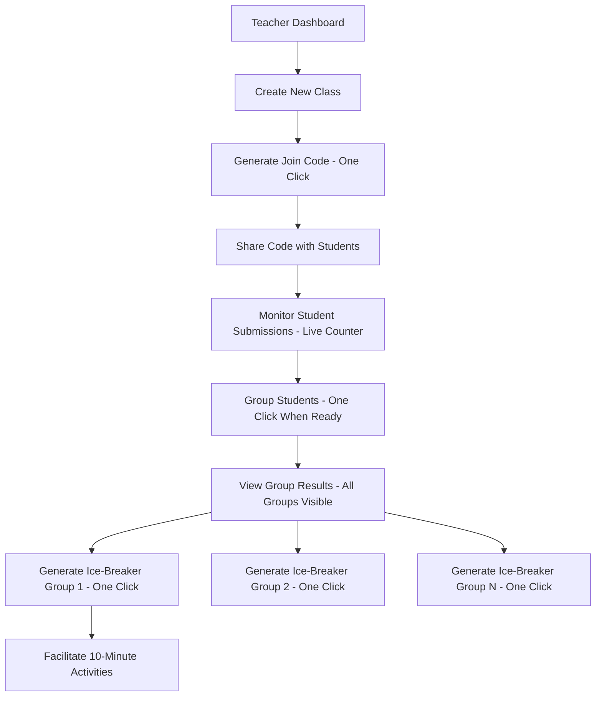

# ConnectClass UI/UX Specification

This document defines the user experience goals, information architecture, user flows, and visual design specifications for ConnectClass's user interface. It focuses on clean, accessible design that prioritizes usability and cultural sensitivity for Japanese educational environments.

## Overall UX Goals & Principles

### Target User Personas

**Japanese Students (Primary):** First-year high school and university students meeting strangers for the first time, experience social anxiety that prevents natural connection (86% report group setting anxiety), need culturally-relevant ice-breaking tools to speed up connections and overcome initial shyness.

**Japanese Teachers (Secondary):** Educators seeking tools to improve classroom dynamics, need intuitive interfaces with comprehensive information available, want to facilitate "magical 10-minute interactions" that reduce student anxiety through simple, clear experiences.

**Cultural Consultants (Tertiary):** Content reviewers ensuring 95%+ cultural appropriateness approval, need workflow tools for scenario review and approval.

### Usability Goals

- Ease of learning: Students can join classes within 30 seconds using simple 6-digit codes
- Efficiency of use: Teachers can create classes and monitor progress with minimal cognitive load
- Cultural recognition: 80%+ of students find personality scenarios personally relevant and engaging
- Assessment completion: Achieve 80%+ completion rate through clear, straightforward presentation
- Anxiety reduction: Interface design reduces social anxiety through calm, encouraging design

### Design Principles

1. **Simplicity First** - Clean, uncluttered interfaces that reduce cognitive load
2. **Cultural Sensitivity** - Respectful integration of Japanese cultural elements
3. **Accessibility** - WCAG AA compliance with clear visual hierarchy
4. **Trust Building** - Transparent, reassuring design that builds confidence
5. **Mobile Optimization** - Touch-friendly interfaces optimized for mobile devices

## Information Architecture (IA)

### Site Map / Screen Inventory

### Navigation Structure

**Primary Navigation:**
- Landing page with three clear paths: "Join Class" (anonymous), "Student Login" (returning users), "Teacher Login"
- Students: Linear flow with minimal navigation to reduce anxiety
- Teachers: Tab-based navigation: Classes, Active Session, Settings

**Secondary Navigation:**
- Contextual help buttons and progress indicators
- Students see gentle "back" options during assessment
- Teachers access detailed views through expandable group cards

## User Flows

### Flow 1: Anonymous First-Time Student Journey

**User Goal:** Join class and discover compatible classmates without registration pressure

**Entry Points:** Landing page code entry, teacher-shared join code

**Success Criteria:** Complete assessment, see group formation, receive ice-breaker activities

**Landing Page Design & Messaging:**

**Layout:**
- **Center Stage:** Large "Enter Class Code" button with 6-digit input field
- **Corner Elements:** Small "Teacher Login" and "Student Login" buttons
- **Below Code Entry:** Concise purpose messaging

**Primary Messaging:**
**"Turn awkward first days into lasting friendships"**
*Subtext: Find classmates who share your interests and energy*

**Purpose Explanation Screen (After Valid Code Entry):**
*"This quick activity helps us understand what makes you unique, so we can connect you with classmates who truly get you. Answer honestly - there are no wrong answers, only authentic connections waiting to happen."*

### Flow 2: Teacher Class Management

**User Goal:** Create class, monitor progress, generate targeted ice-breakers efficiently

**Entry Points:** Teacher login, dashboard

**Success Criteria:** Groups formed with customized ice-breakers ready for immediate classroom use

## Personality Assessment Design

### Question Framework

**Core Innovation:** Combine scientifically-validated HEXACO personality measurement with relatable hobby scenarios that create instant conversation starters and reduce assessment anxiety.

### Example Questions by HEXACO Dimension

#### 1. Extraversion (Social Energy & Enthusiasm)
**Scenario:** "You discover a tiny café that serves 47 different types of matcha, but it's hidden in a basement with no sign."

**Options:**
- A) **Keep it as your secret study spot** *(Low Extraversion)*
- B) **Bring your best friend next week** *(Medium-Low)*
- C) **Post about it in your class group chat** *(Medium-High)*
- D) **Start a "Hidden Tokyo Spots" Instagram account** *(High Extraversion)*

*Conversation Starter Created: "Wait, you also hunt for hidden cafés?!"*

#### 2. Agreeableness (Cooperation & Trust)
**Scenario:** "Your friend asks you to co-create a manga together, but they want the main character to have a completely different personality than what you envisioned."

**Options:**
- A) **Insist your character concept is better** *(Low Agreeableness)*
- B) **Suggest combining both ideas somehow** *(Medium)*
- C) **Go with their idea to keep peace** *(Medium-High)*
- D) **Get excited about their creative vision** *(High Agreeableness)*

*Conversation Starter: "You also draw manga?! What style?"*

### Assessment Interaction Design

**Visual Presentation:**
- Clean, card-based layout with soft shadows
- Each scenario presented as short, engaging story
- 4 options shown as clear, distinct choices
- Simple progress indicator showing completion
- Encouraging micro-animations for selections

**UX Flow per Question:**
1. **Scenario Introduction:** "Imagine this situation..."
2. **Visual Context:** Simple illustration or icon
3. **Response Selection:** "What would you most likely do?"
4. **Gentle Affirmation:** "Interesting choice! Let's explore more..."
5. **Progress:** Dot indicator showing journey completion

## Wireframes & Key Screen Layouts

### Landing Page
**Purpose:** Welcome first-year students and provide clear entry paths

**Key Elements:**
- Large, centered "Enter Class Code" input field with 6-digit format
- Inspiring headline: "Turn awkward first days into lasting friendships"
- Small corner buttons for Teacher Login and Student Login
- Brief explanatory text about finding compatible classmates
- Clean, minimal design with focus on the code entry

### Personality Assessment
**Purpose:** Present personality questions as engaging scenarios rather than clinical assessments

**Key Elements:**
- Clean question card with soft border
- Short scenario text with cultural context
- 4 response options presented as character choices
- Simple progress indicator (dots, not percentages)
- Minimal design to reduce anxiety

### Group Formation Results
**Purpose:** Celebrate successful group creation and build excitement for ice-breaker activities

**Key Elements:**
- Simple group display showing 4 compatible students
- Clear compatibility messaging with positive tone
- Clean avatars or identifiers for group members
- Highlighted shared personality traits and interests
- Clear transition to ice-breaker activities

### Teacher Dashboard - Group Management
**Purpose:** Enable efficient group monitoring and ice-breaker generation during live classroom

**Key Elements:**
- Real-time student submission counter
- One-click "Create Groups" button (enabled when ready)
- Simple group cards showing 4 members each
- Individual "Generate Ice-Breaker" buttons per group
- Clean, organized layout for classroom use

## Design System

### Visual Identity Philosophy
**Design Approach:** Clean, accessible, and culturally sensitive design that reduces anxiety and builds trust. Focus on clarity over complexity.

### Color Palette
| Color Type | Hex Code | Usage |
|------------|----------|--------|
| Primary Blue | #6366F1 | Main actions, links, progress indicators |
| Success Green | #10B981 | Success states, completed actions |
| Neutral Gray | #6B7280 | Secondary text, borders |
| Light Gray | #F9FAFB | Background, card surfaces |
| White | #FFFFFF | Primary background |
| Dark Gray | #111827 | Primary text |

### Typography
- **Primary:** 'Inter', sans-serif (clean, readable)
- **Japanese:** 'Noto Sans JP', sans-serif (proper Japanese support)
- **Display:** 'Inter', sans-serif with increased weight

### Typography Scale
| Element | Size | Weight | Line Height |
|---------|------|--------|-------------|
| H1 Display | 32px | 700 | 1.1 |
| H2 Section | 24px | 600 | 1.2 |
| H3 Subsection | 20px | 600 | 1.3 |
| Body Large | 18px | 400 | 1.5 |
| Body Default | 16px | 400 | 1.5 |
| Body Small | 14px | 400 | 1.4 |

### Component Library

#### Basic Card Component
**Purpose:** Container for scenarios, results, and information
**Features:**
- Clean white background with subtle border
- Soft shadow for depth
- 12px border radius
- Proper spacing and typography hierarchy

#### Primary Button
**Purpose:** Main actions (Join Class, Submit Answer, Generate Groups)
**Features:**
- Primary blue background (#6366F1)
- White text with proper contrast
- 8px border radius
- Clear hover and focus states

#### Input Field
**Purpose:** Code entry, form inputs
**Features:**
- Clean border with focus state
- Large enough for touch interaction (44px minimum)
- Clear error states
- Proper labeling for accessibility

### Spacing & Layout
**Grid System:** 8px grid system for consistent spacing

**Spacing Scale:** 4px, 8px, 12px, 16px, 24px, 32px, 48px, 64px

**Responsive Breakpoints:**
- Mobile: 320px - 768px (primary focus)
- Tablet: 769px - 1024px (teacher dashboard optimization)
- Desktop: 1025px+ (extended teacher features)

## Accessibility Requirements

### Compliance Target
**Standard:** WCAG AA compliance for educational environments

### Visual Accessibility
- **Color contrast ratios:** 4.5:1 minimum for normal text, 3:1 for large text
- **Focus indicators:** Clear 2px outline on interactive elements
- **Text sizing:** Minimum 16px for body text, scalable to 200%
- **Color-blind friendly:** No reliance on color alone for meaning

### Interaction Accessibility
- **Touch targets:** Minimum 44px for mobile interactions
- **Keyboard navigation:** Complete flow navigable via keyboard
- **Screen reader support:** Proper semantic markup with ARIA labels
- **Error handling:** Clear, helpful error messages

### Content Accessibility
- **Alternative text:** Descriptions for all images and illustrations
- **Cultural context:** Explanations available for cultural references
- **Simple language:** Clear, jargon-free instructions
- **Progress indication:** Multiple ways to understand progress

## Performance Considerations

### Performance Goals
- **Page Load:** < 2 seconds on 3G mobile connections
- **Interaction Response:** < 200ms for all user actions
- **Image Loading:** Progressive loading for any illustrations

### Design Strategies
- Minimal use of images
- Optimized font loading for Japanese characters
- Simple animations using CSS transforms
- Clean, lightweight design

## Animation & Micro-interactions

### Simple Animation Principles
- **Subtle Feedback:** Gentle hover states and focus indicators
- **Smooth Transitions:** 200-300ms transitions between states
- **Progress Feedback:** Simple loading states during processing
- **Success Celebration:** Gentle confirmation animations

### Key Animations
- **Button Press:** Subtle scale (0.98) on press
- **Card Selection:** Gentle shadow expansion
- **Form Validation:** Smooth error/success state transitions
- **Progress Updates:** Gentle dot filling for progress indicators

## Next Steps

### Immediate Design Implementation
1. **Design System Creation:** Create comprehensive Figma design system with all components
2. **Prototype Development:** Build interactive prototypes for all major user flows
3. **Cultural Validation:** Review cultural elements with Japanese consultants
4. **Accessibility Testing:** Comprehensive accessibility audit
5. **User Testing:** Test with Japanese students for usability validation

### Technical Implementation Preparation
- Create detailed component specifications
- Define responsive behavior for all components
- Establish accessibility testing protocols
- Plan performance optimization strategies

This simplified specification focuses on clean, accessible design that prioritizes user needs over visual complexity while maintaining cultural sensitivity and educational effectiveness.